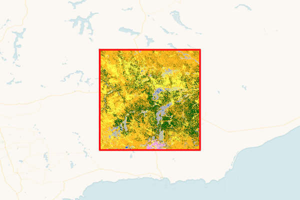
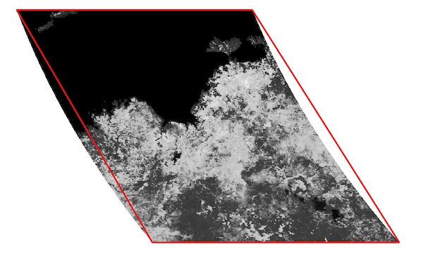
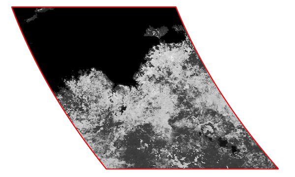
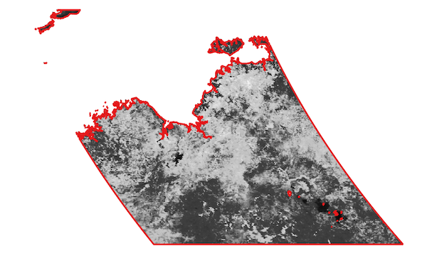
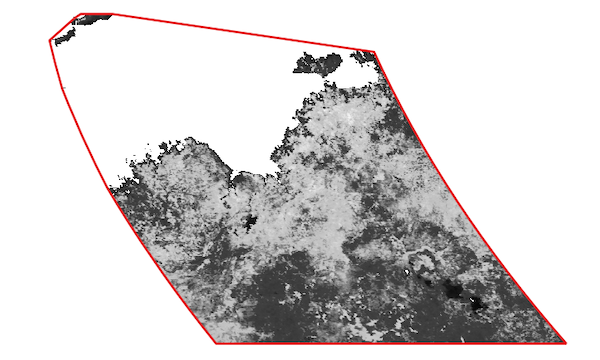

.. raster-footprint documentation master file, created by
   sphinx-quickstart on Sat Aug  5 14:13:46 2023.
   You can adapt this file completely to your liking, but it should at least
   contain the root `toctree` directive.

raster-footprint
================

A Python package for creating GeoJSON_ geometries that bound valid data in a geospatial
rasters.

What is a raster footprint?
---------------------------

A raster footprint is one or more polygons that surround valid data in a raster, or a
single polygon surrounding the entire raster grid. For example, a single polygon that
surrounds the entire raster grid of an ESA WorldCover tile:

   The raster footprint (red polygon) for an ESA WorldCover tile

The **raster-footprint** package generates a GeoJSON_ representation of the polygon:

.. code-block:: json

   {
      "type": "Polygon",
      "coordinates": [
         [
            [120.0, -30.0],
            [120.0, -33.0],
            [123.0, -33.0],
            [123.0, -30.0],
            [120.0, -30.0]
         ]
      ]
   }

What are the challenges?
-------------------------------------------------------

By definition, GeoJSON_ geometries contain point sequences with coordinates referenced
to the WGS84 (EPSG:4326) datum. However, unlike the ESA WorldCover example above, most
geospatial raster products exist in a projected coordinate system that is distorted with
respect to WGS84. This leads to gaps between the raster data and the GeoJSON_ polygons.
For exampe, MODIS tiles are in a sinusoidal projection and are distorted when transformed
to WGS84. A simple four-corner polygon at the tile corners results in gaps and gores:

   A MODIS tile and footprint in WGS84

One way to remove these gaps is to insert additional vertices into the polygon(s) prior
to transformation to WGS84. **Raster-footprint** provides options for densifying by
"factor" and by "distance".

   Footprint densified at a 10 km interval ("distance" densification)

Another challege results from the fact that many geospatial rasters contain pixels that
do not contain data, commonly termed "nodata" pixels. These nodata pixels are black in
our MODIS example. We can exclude them from the footprint:

   Footprint excluding nodata pixels

However, this increases the number and complexity of the polygons in the footprint. Our
example footprint now contains over 150 polygons and almost 9000 coordinate pairs,
resulting in a GeoJSON_ text file approaching 1 MB in size. **Raster-footprint**
provides options for reducing complexity by removing polygon holes, simplifying the
polygons up to an error tolerance, and/or applying a convex hull to the footprint. For
our current MODIS example, simplifying with an error tolerance roughly equal to 1 pixel
of ground distance reduces the footprint coordinate pair count to under 2000. For a very
simple footprint, applying a convex hull along with the same simplification tolerance
produces a single polygon with only 25 coordinate pairs:

   Convex hull applied to the footprint

The challenge is to balance the competing interests of *maximizing footprint fidelity*
to the raster data while *limiting footprint complexity* by reducing the number of
coordinates to a reasonable number. This balance is specific to the application and user
preference.

How does the raster-footprint package help?
-----------------------------------------------

The **raster-footprint** package provides an API for creating footprints with options to
tune acceptable projection error and to reduce footprint complexity. With
**raster-footprint** you can:

*Use a variety of data sources:*

- raster files openable by `rasterio
  <https://rasterio.readthedocs.io/en/stable/index.html>`_
- `rasterio <https://rasterio.readthedocs.io/en/stable/index.html>`_ `DatasetReader
  <https://rasterio.readthedocs.io/en/stable/api/rasterio.io.html#rasterio.io.DatasetReader>`_
  objects
- `NumPy <https://numpy.org/doc/stable/index.html>`_ arrays of raster data
- `NumPy <https://numpy.org/doc/stable/index.html>`_ arrays of mask values (arrays of 0s
  and 255s for nodata/data pixels)

*Mitigate projection distortion effects:*

- insert additional polygon vertices via a densification factor or densification distance

*Reduce footprint complexity:*

- use the entire raster grid, i.e., include nodata pixels
- discard polygon holes
- simplify the polygons with the `Douglas-Peucker
  <https://en.wikipedia.org/wiki/Ramer%E2%80%93Douglas%E2%80%93Peucker_algorithm>`_
  algorithm
- apply a convex hull to the footprint

*Be selective:*

- choose one or more bands from a multiband raster for footprint creation

*Specify a CRS:*

- specify a CRS other than WGS84 for the footprint (caution - invalid GeoJSON_!)

.. toctree::
   :maxdepth: 2
   :caption: Contents:

   api

Indices and tables
==================

* :ref:`genindex`
* :ref:`search`

.. _GeoJSON: https://datatracker.ietf.org/doc/html/rfc7946